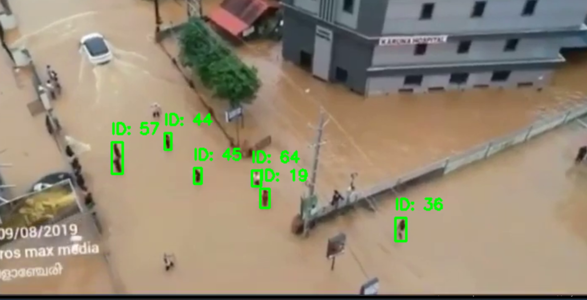
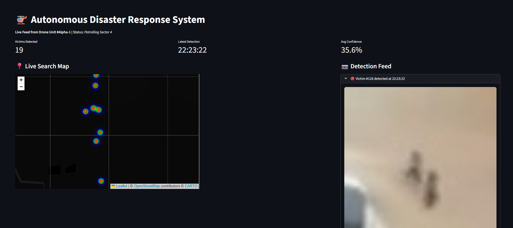

#  Autonomous Flood Rescue Drone (Vision Node)

###  Problem Statement
During natural disasters like floods, identifying stranded victims in real-time is the biggest bottleneck for rescue teams. Traditional manual drone piloting is slow, and cloud-based AI fails when the internet is down.

###  The Solution
This project implements the **Edge Perception & Decision Layer** for autonomous rescue drones. It uses **YOLOv8** to detect humans in flood zones from aerial footage and instantly logs their GPS coordinates to a central Command Center dashboard.

###  Architecture
- **Edge Node:** Python + YOLOv8 (Runs on Drone/Jetson)
- **Comms:** JSON Telemetry Log (Simulates MAVLink/4G Stream)
- **Command Center:** Streamlit Dashboard (For Rescue Coordinators)

### 📋 Prerequisites
* **Python 3.8+** (Tested on 3.10/3.11)
* **FFmpeg** *(Recommended)*:
    * Used to trim video clips for faster download/processing.
    * *If missing, the system will automatically switch to "Safe Mode" and download full-length videos instead.*
* run it on a virtual python environment if possible

###  How to Run
1. **Clone the repo:**
   ```bash
   git clone [https://github.com/whoisadi19/flood-rescue-drone.git](https://github.com/whoisadi19/flood-rescue-drone.git)
   cd flood-rescue-drone
2. **Install Dependencies:**
   ```bash
   pip install -r requirements.txt
3. **Initialize Mission Library (CRITICAL): This script downloads 3 different test scenarios (Urban, Rooftop, Survey).
   ```bash
   python get_data.py
4. **Run the Drone Vision Node:**
   ```bash
   cd edge_node
   python yolo_inference.py
5. ***Run the Dashboard:**
   ```bash
   cd command_center
   streamlit run dashboard.py

### 📸 Demo
**1. Autonomous Drone Vision (Edge Node)**
*Real-time object detection identifying stranded victims.*


**2. Command Center Dashboard**
*Live telemetry and GPS tracking of identified survivors.*

