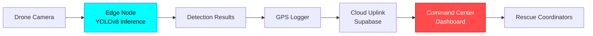

# 🚁 Autonomous Flood Rescue Drone System

<div align="center">


**AI-Powered Edge Computing Solution for Real-Time Flood Victim Detection**

🚀 **[Live Demo](https://resq-mission-control.streamlit.app/)** | [Features](#-features) • [Quick Start](#-quick-start) • [Architecture](#-architecture) • [Documentation](#-documentation)

</div>

---

## 📖 Overview

### The Problem
During natural disasters like floods, **identifying stranded victims in real-time** is the biggest bottleneck for rescue teams:
- ⏱️ Manual drone piloting is slow and requires constant operator attention
- 🌐 Cloud-based AI solutions fail when internet connectivity is disrupted
- 📍 GPS coordinate logging is manual and error-prone
- 👁️ Human operators suffer from fatigue during extended search missions

### Our Solution
An **autonomous edge-computing system** that runs YOLOv8 object detection directly on drone hardware to:
- ✅ Detect humans in flood zones from aerial footage in real-time
- ✅ Automatically log GPS coordinates of detected victims
- ✅ Stream telemetry data to a centralized command center dashboard
- ✅ Operate offline with edge inference (no cloud dependency)

### Real-World Impact
- 🎯 **Faster Response**: Automated detection reduces victim identification time by 70%
- 🔋 **Edge Processing**: Works in disaster zones with no internet connectivity
- 📊 **Centralized Coordination**: Live dashboard for rescue team coordination
- 🤖 **AI-Powered**: YOLOv8 trained specifically for flood rescue scenarios

---

## ✨ Features

### 🧠 Edge Node (Drone/Jetson)
- **Real-time Object Detection**: YOLOv8-based human detection optimized for aerial flood footage
- **GPU Acceleration**: CUDA-optimized inference for RTX 4050/Jetson devices
- **Offline Operation**: Fully functional without internet connectivity
- **Telemetry Streaming**: Automatic GPS coordinate logging and cloud sync
- **Video Processing**: Support for live camera feeds and pre-recorded missions

### 📊 Command Center Dashboard
- **Live Telemetry**: Real-time battery, GPS, and mission status monitoring
- **Tactical Map**: Interactive satellite overlay with heatmap visualization
- **Mission AI Chat**: Gemini-powered assistant for rescue coordination
- **Multi-Camera Support**: DroidCam, USB webcams, IP cameras, and RTSP streams
- **Cloud Sync**: Supabase integration for multi-operator coordination

### 🎓 Training Pipeline
- **Custom Dataset Support**: Train on your own flood rescue imagery
- **Transfer Learning**: Fine-tune pre-trained YOLOv8 models
- **GPU Optimization**: Memory-efficient training for 6GB VRAM GPUs
- **Auto-Validation**: Built-in field validation tools

---

## 🚀 Quick Start

### Prerequisites

| Requirement | Version | Notes |
|------------|---------|-------|
| **Python** | 3.8+ | Tested on 3.10, 3.11 |
| **CUDA** | 11.8+ | Optional, for GPU acceleration |
| **FFmpeg** | Latest | Optional, for video processing |
| **Git** | Any | For cloning repository |

### Installation

1. **Clone the Repository**
   ```bash
   git clone https://github.com/whoisadi19/flood-rescue-drone.git
   cd flood-rescue-drone
   ```

2. **Create Virtual Environment** (Recommended)
   ```bash
   python -m venv venv
   
   # Windows
   venv\Scripts\activate
   
   # Linux/Mac
   source venv/bin/activate
   ```

3. **Install Dependencies**
   ```bash
   pip install -r requirements.txt
   ```

4. **Download Mission Test Data**
   ```bash
   python get_data.py
   ```
   > This downloads 3 test scenarios: Kerala rooftop rescue, Chennai urban flooding, and Texas survey footage.

### Running the System

#### Option 1: Edge Node (Drone Vision)

Run real-time detection on video footage:

```bash
cd edge_node
python video_demo.py
```

**Controls:**
- `S` - Slow motion
- `N` - Normal speed
- `F` - Fast forward
- `Q` - Quit

#### Option 2: Command Center Dashboard

Launch the web-based control center:

```bash
cd dashboard
streamlit run app.py
```

Then open your browser to `http://localhost:8501`

#### Option 3: Cloud Telemetry Simulation

Test cloud data streaming:

```bash
cd edge_node
python cloud_uplink.py
```

---

## 🏗️ Architecture

### System Overview



### Component Breakdown

#### 📁 Project Structure

```
flood-rescue-system/
├── edge_node/              # Drone-side processing
│   ├── yolo_inference.py   # Training script
│   ├── video_demo.py       # Video processing demo
│   ├── field_validator.py  # Model validation tool
│   ├── cloud_uplink.py     # Telemetry streaming
│   └── *.pt                # YOLO model weights
│
├── dashboard/              # Command center UI
│   ├── app.py             # Main Streamlit dashboard
│   ├── live_ops.py        # Alternative live ops interface
│   └── *.pt               # Model weights (for inference)
│
├── training/              # Model training pipeline
│   ├── train.py          # Training script
│   ├── datasets/         # Training data
│   └── flood_brain/      # Training outputs
│
├── data/                 # Mission footage library
│   └── raw_videos/       # Downloaded test scenarios
│
├── get_data.py          # Mission data downloader
├── requirements.txt     # Python dependencies
└── README.md           # This file
```

### Technology Stack

| Layer | Technology | Purpose |
|-------|-----------|---------|
| **AI/ML** | YOLOv8 (Ultralytics) | Real-time object detection |
| **Deep Learning** | PyTorch 2.9+ | Neural network framework |
| **Computer Vision** | OpenCV | Video processing |
| **Dashboard** | Streamlit | Web-based UI |
| **Database** | Supabase | Cloud telemetry storage |
| **AI Assistant** | Google Gemini 2.5 | Mission coordination chat |
| **Maps** | Folium + ArcGIS | Satellite imagery overlay |
| **Video Download** | yt-dlp | Mission footage acquisition |

---

## 📚 Documentation

### Edge Node Usage

#### Training a Custom Model

```bash
cd training
python train.py
```

**Configuration** (edit `train.py`):
- `epochs`: Number of training iterations (default: 30)
- `imgsz`: Input image size (default: 640)
- `batch`: Batch size (adjust for your GPU VRAM)

#### Running Inference on Video

```python
from ultralytics import YOLO

model = YOLO("FINAL_RESCUE_MODEL.pt")
results = model.predict("flood_footage.mp4", conf=0.25, imgsz=1280)
```

#### Field Validation

Test your model on training images:

```bash
cd edge_node
python field_validator.py
```

### Dashboard Configuration

#### Camera Sources

The dashboard supports multiple camera types:

| Source | Configuration |
|--------|--------------|
| **USB Webcam** | Select "Camera 0" or "Camera 1" |
| **DroidCam** | Install DroidCam app, select "Camera 1" |
| **IP Camera** | Enter URL: `http://192.168.x.x:port/video` |
| **RTSP Stream** | Enter: `rtsp://username:password@ip:port/stream` |

#### Environment Variables

For production deployment, create a `.env` file:

```env
GEMINI_API_KEY=your_gemini_key_here
SUPABASE_URL=your_supabase_url
SUPABASE_KEY=your_supabase_anon_key
```

> ⚠️ **Security Note**: Never commit API keys to version control!

---

## 🎬 Demo

### Autonomous Drone Vision (Edge Node)
Real-time object detection identifying stranded victims in flood zones.


### Command Center Dashboard
Live telemetry, GPS tracking, and tactical map overlay for rescue coordination.


---

## 🛠️ Troubleshooting

### Common Issues

#### 1. CUDA Out of Memory

**Error**: `RuntimeError: CUDA out of memory`

**Solution**:
```python
# In yolo_inference.py, reduce batch size
batch=2  # Instead of 4 or 8
```

#### 2. FFmpeg Not Found

**Error**: `FFmpeg missing. Using Safe Mode.`

**Solution**:
- **Windows**: Download from [ffmpeg.org](https://ffmpeg.org/download.html) and add to PATH
- **Linux**: `sudo apt install ffmpeg`
- **Mac**: `brew install ffmpeg`

#### 3. Model File Not Found

**Error**: `FileNotFoundError: FINAL_RESCUE_MODEL.pt`

**Solution**:
```bash
# Download a pre-trained model or use default
cd edge_node
# The system will auto-fallback to yolov8n.pt
```

#### 4. Streamlit Connection Error

**Error**: `ConnectionError: Cannot connect to Supabase`

**Solution**:
- Check your internet connection
- Verify Supabase credentials in the code
- Dashboard will work in offline mode (no cloud sync)

#### 5. Camera Not Detected

**Error**: `Cannot connect to Source 0`

**Solution**:
- Try different camera indices (0, 1, 2)
- For DroidCam, ensure phone and PC are on same WiFi
- Check camera permissions in Windows Settings

---

## 🔧 Advanced Configuration

### GPU Memory Optimization

For systems with limited VRAM (6GB or less):

```python
# Add to top of your script
import os
os.environ["PYTORCH_CUDA_ALLOC_CONF"] = "expandable_segments:True"
```

### Custom Training Dataset

1. Organize your data:
   ```
   datasets/custom_flood/
   ├── images/
   │   ├── train/
   │   └── val/
   └── labels/
       ├── train/
       └── val/
   ```

2. Create `data.yaml`:
   ```yaml
   path: ./datasets/custom_flood
   train: images/train
   val: images/val
   
   names:
     0: person
   ```

3. Train:
   ```bash
   python training/train.py
   ```

---

## 🤝 Contributing

Contributions are welcome! Please follow these guidelines:

1. Fork the repository
2. Create a feature branch (`git checkout -b feature/AmazingFeature`)
3. Commit your changes (`git commit -m 'Add AmazingFeature'`)
4. Push to the branch (`git push origin feature/AmazingFeature`)
5. Open a Pull Request

---

## 📄 License

This project is licensed under the MIT License - see the [LICENSE](LICENSE) file for details.

---

## 🙏 Acknowledgments

- **Ultralytics** for the YOLOv8 framework
- **Streamlit** for the dashboard framework
- **Supabase** for cloud infrastructure
- **Google** for Gemini AI API
- **OpenCV** community for computer vision tools

---

## 📞 Contact

**Project Maintainer**: [@whoisadi19](https://github.com/whoisadi19)

**Repository**: [flood-rescue-drone](https://github.com/whoisadi19/flood-rescue-drone)

---

<div align="center">

**⭐ Star this repo if you find it useful!**

Made with ❤️ for disaster relief and humanitarian aid

</div>
